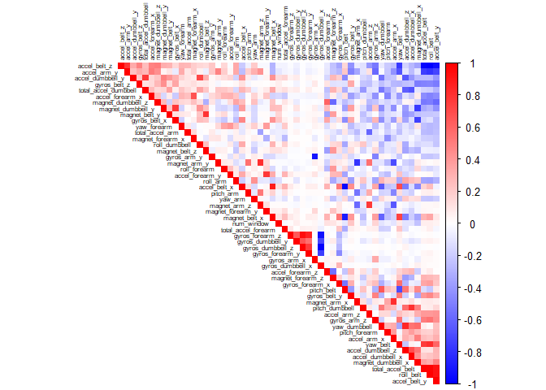
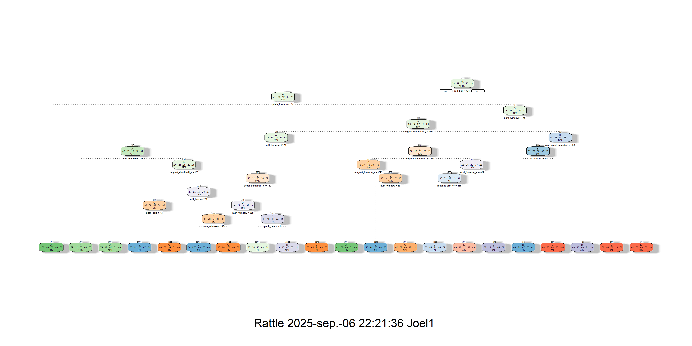

Peer-graded Assignment: Prediction Assignment Writeup
================
Joel Castillo Espinosa
2025-09-06

If you want to see the Rpubs page of the aasignment you can visit: [Rpubs page](https://rpubs.com/Joelcae/practical_ml_assig8). Also, the github page is available and html file is in the this repo.

## OVERVIEW

The goal of this project is to predict the manner in which they did the
exercise. This is the “classe” variable in the training set. I use the
methods of the Course Practical Machine Learning.

The training and test data for this project are available here:

- [Training
  data](https://d396qusza40orc.cloudfront.net/predmachlearn/pml-training.csv "Training data")

- [Test
  data](https://d396qusza40orc.cloudfront.net/predmachlearn/pml-testing.csv "Test data")

## LIBRARIES

``` r
library(caret)
library(ggplot2)
library(corrplot)
library(rpart)
library(rattle) 
library(randomForest)
```

## DATA MANAGE

First, read the training and test data sets.

``` r
set.seed(100) # seed

data_testing <- read.csv("pml-testing.csv",  na.strings = c("NA",""))
data_training <- read.csv("pml-training.csv",  na.strings = c("NA",""))
```

Split the training data, for this I use 75 % of the set for the model
training.

``` r
partition_set  <- createDataPartition(data_training$classe, p=0.75, list=FALSE)
train_set  <-  data_training[partition_set, ]
test_set  <-  data_training[-partition_set, ]
```

It is necessary to remove some variables, in specific, the Null and the
Near-Zero-Variance variables.

``` r
zero_vars <- nearZeroVar(train_set)
train_set  <- train_set[, -zero_vars]
test_set  <-  test_set [, -zero_vars]
```

``` r
na_vars <- sapply(train_set, function(x) mean(is.na(x))) > 0.95
train_set  <-  train_set[, na_vars == F]
test_set  <-  test_set[, na_vars == F]
```

Then, the final data training remain with 54 variables.

``` r
train_set <- train_set[ , -(1:5)]
test_set  <- test_set[ , -(1:5)]
dim(train_set)
```

    ## [1] 14718    54

``` r
dim(test_set)
```

    ## [1] 4904   54

## ANALYSIS

It is important to know if the Principal Components Analysis (PCA) is
necessary for the model. We can see the correlations between the
variables to determine this.

``` r
cor_matrix <- cor(train_set[ ,-54])
```

``` r
corrplot(cor_matrix, order = "FPC",method = "color", type = "upper", 
         col = colorRampPalette(c("blue", "white", "red"))(200),
         number.cex = 0.7, tl.cex = 0.5,  tl.col = "black")
```

<!-- -->

The correlation matrix does not show a significant signal to apply PCA.

## MODELS

### DECISION TREE MODEL

Fit the decision tree model

``` r
model_tree <- rpart(classe ~ ., data = train_set, method="class")
png("model_tree.png", width = 4000, height = 2000, res = 500)
fancyRpartPlot(model_tree)
```

    ## Warning: labs do not fit even at cex 0.15, there may be some overplotting

``` r
dev.off()
```

    ## png 
    ##   2

<figure>

<figcaption aria-hidden="true">Decision Tree Model</figcaption>
</figure>

Predict and get the accuracy of the decision tree model.

``` r
predict_tree <- predict(model_tree , newdata = test_set, type="class")
conf_matrix_tree <- confusionMatrix(predict_tree, factor(test_set$classe))
conf_matrix_tree
```

    ## Confusion Matrix and Statistics
    ## 
    ##           Reference
    ## Prediction    A    B    C    D    E
    ##          A 1247  209   36   68   23
    ##          B   29  530   57   30   34
    ##          C   17   65  678  112   73
    ##          D   77  117   62  514  118
    ##          E   25   28   22   80  653
    ## 
    ## Overall Statistics
    ##                                          
    ##                Accuracy : 0.7386         
    ##                  95% CI : (0.726, 0.7508)
    ##     No Information Rate : 0.2845         
    ##     P-Value [Acc > NIR] : < 2.2e-16      
    ##                                          
    ##                   Kappa : 0.6682         
    ##                                          
    ##  Mcnemar's Test P-Value : < 2.2e-16      
    ## 
    ## Statistics by Class:
    ## 
    ##                      Class: A Class: B Class: C Class: D Class: E
    ## Sensitivity            0.8939   0.5585   0.7930   0.6393   0.7248
    ## Specificity            0.9042   0.9621   0.9341   0.9088   0.9613
    ## Pos Pred Value         0.7877   0.7794   0.7175   0.5788   0.8082
    ## Neg Pred Value         0.9554   0.9008   0.9553   0.9278   0.9395
    ## Prevalence             0.2845   0.1935   0.1743   0.1639   0.1837
    ## Detection Rate         0.2543   0.1081   0.1383   0.1048   0.1332
    ## Detection Prevalence   0.3228   0.1387   0.1927   0.1811   0.1648
    ## Balanced Accuracy      0.8991   0.7603   0.8635   0.7740   0.8430

The decision tree model has an accuracy of 0.728.

``` r
control_random <- trainControl(method = "repeatedcv", number =  3, repeats = 1)
```

### RANDOM FOREST MODEL

Fit the random forest model

``` r
 model_random <- train(classe ~ ., data = train_set, method = "rf",
                trControl =control_random,ntree = 100, tuneLength = 3,  verbose = FALSE)
```

Predict and get the accuracy of random forest model.

``` r
predict_random <- predict(model_random, newdata = test_set)
conf_matrix_random <- confusionMatrix(predict_random , factor(test_set$classe))
conf_matrix_random
```

    ## Confusion Matrix and Statistics
    ## 
    ##           Reference
    ## Prediction    A    B    C    D    E
    ##          A 1395    0    0    0    0
    ##          B    0  949    2    0    0
    ##          C    0    0  853    3    0
    ##          D    0    0    0  801    0
    ##          E    0    0    0    0  901
    ## 
    ## Overall Statistics
    ##                                           
    ##                Accuracy : 0.999           
    ##                  95% CI : (0.9976, 0.9997)
    ##     No Information Rate : 0.2845          
    ##     P-Value [Acc > NIR] : < 2.2e-16       
    ##                                           
    ##                   Kappa : 0.9987          
    ##                                           
    ##  Mcnemar's Test P-Value : NA              
    ## 
    ## Statistics by Class:
    ## 
    ##                      Class: A Class: B Class: C Class: D Class: E
    ## Sensitivity            1.0000   1.0000   0.9977   0.9963   1.0000
    ## Specificity            1.0000   0.9995   0.9993   1.0000   1.0000
    ## Pos Pred Value         1.0000   0.9979   0.9965   1.0000   1.0000
    ## Neg Pred Value         1.0000   1.0000   0.9995   0.9993   1.0000
    ## Prevalence             0.2845   0.1935   0.1743   0.1639   0.1837
    ## Detection Rate         0.2845   0.1935   0.1739   0.1633   0.1837
    ## Detection Prevalence   0.2845   0.1939   0.1746   0.1633   0.1837
    ## Balanced Accuracy      1.0000   0.9997   0.9985   0.9981   1.0000

The decision tree model has an accuracy of 0.992.

## TEST

Finally, I use the random forest model to predict the data test. The use
of this model is based on the accuracy of the models, random forest
model has the best accuracy (0.992).

``` r
result_test <- predict(model_random, newdata = data_testing)
result_test
```

    ##  [1] B A B A A E D B A A B C B A E E A B B B
    ## Levels: A B C D E

